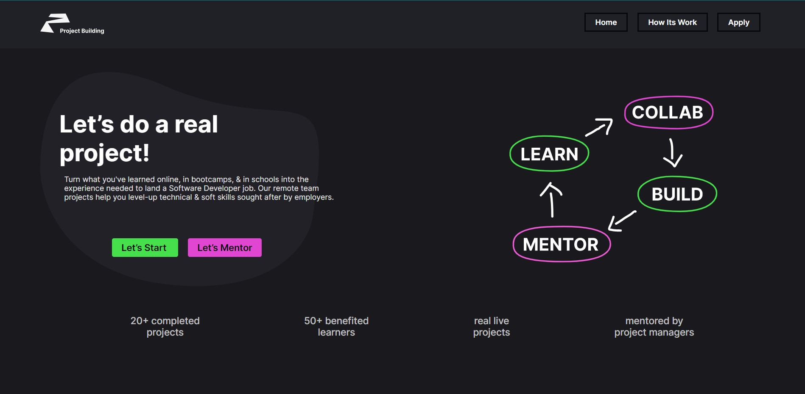
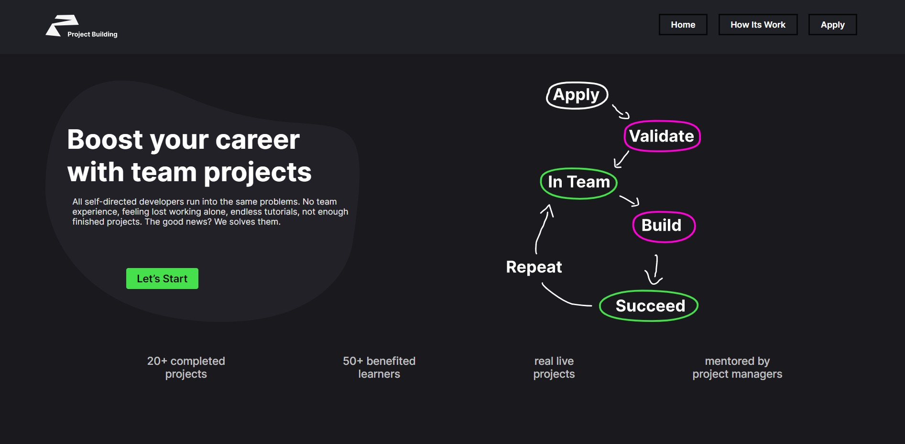

# Project Building APP

### For new beginner and intermediate coders it always been a tough task to build a project alone

#### They learn from various bootcamps, courses and online materials but they find it difficult to make/build projects by their own.

So to solve this problem i build a community website where students as well as experts come together and work on many real life problems and find and make solutions.

### Benifits to students
- Gets real experience that how a project work in a company
- Increase in self confidence 
- Learn new skills and tips and good practices from mentors
- Get industry experience which help them in getting a good job
- Make good connections
- Increase social skills

### Benifits to mentors
- Get experience in managing group
- Get insentives on mentoring groups
- learn new tech with new people

## Path of the project building journey with us 

- First apply.
- Then provide your previous work to Validate your expertise through.
- If not done then we provide you a task and then we Validate your expertise through the task.
- Then if you crossed that checkpoin then according to your expertise we add you in a team.
- We provide a mentor and the project you will build with this team.
- Build and complete your work and earn many things like
     - certificate
     - hands on experience
     - new connections
     - new skills
     - confidence
     - portfolio project
 - Succeed and then get a job or lets build other amazing things.

keep smiling :)
